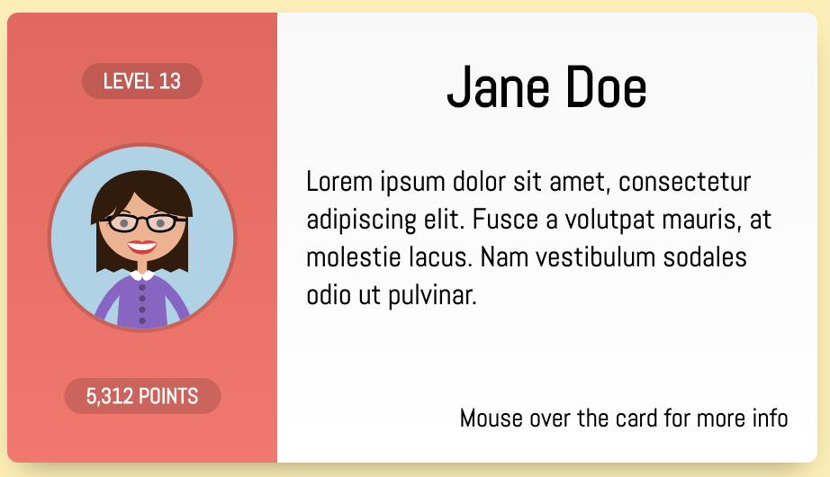

# Intro to React Review

## Essential Questions
**1. What is the virtual DOM?**

**2. What is a component?**

**3. What is JSX?**

## Practice
Answer the following questions using the `index.html` and `app.js` files in this repo.

1. Pull in React, ReactDOM, and Babel from a CDN.

2. Create and render a React component. This component should render the words `Hello, World` as an `h1` HTML element. It should have a class of `"header"`.

3. Create a funtional component `Header` that takes a prop, `title` an renders it as `h1` element. Render a `Header` on the page somewhere so you can check your work.

4. Create a `Card` compenent based on this mock-up. Render it somwhere on your page.
   .

5. Create a `NavBar` component. It should display an unordered list of page links. These links should be generated from an array of objects. The objects should have the page title as a key and the page hyperlink as the value. Render it somwhere on your page.
   ```javascript
   const pageData = [{text: "About", link: "/about"}, {text: "Our Team", link: "/team"}, {text: "Pricing", link: "/pricing"}];
   <NavBar pages={pageData} />
   ```
